# 基本的なウェブアプリケーションを構築するチュートリアルをやってみた

https://aws.amazon.com/jp/getting-started/hands-on/build-web-app-s3-lambda-api-gateway-dynamodb/

## 実装: Amplify コンソールでウェブアプリを作成
- [mod1-build-amplify-app ディレクトリへ](mod1-build-amplify-app/)

> 3. HTML ファイルのみを ZIP (圧縮) します。

アーカイバは何使ってもいいのか? とりあえず 7zip 形式を使ってみる。

> 6. [Git プロバイダーなしでデプロイ] を選択します。以下のように画面に表示されるはずです。

UI 全然違った(´・\_・\`)。
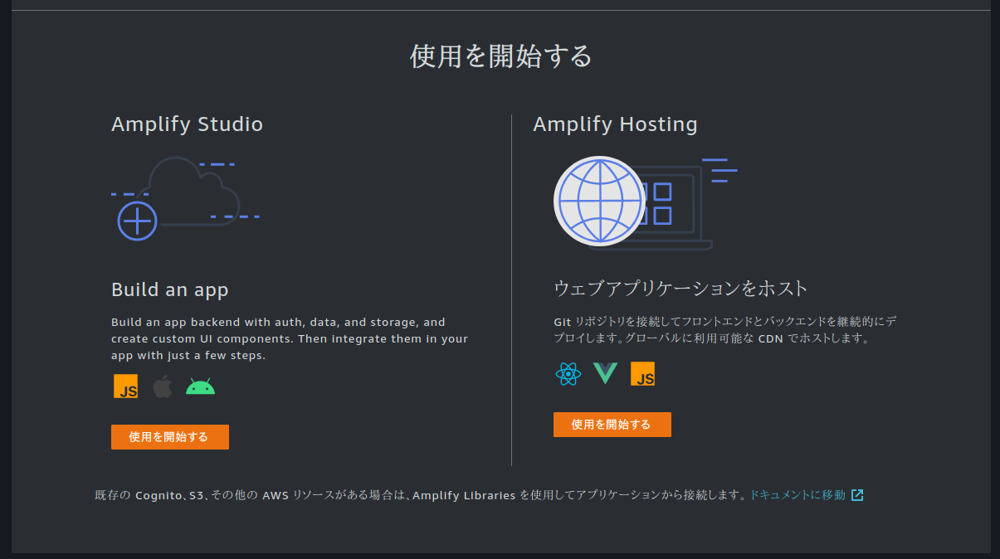

Git 使わない方法だからとりあえず `Amplify Studio` を選んでおけばいいのかな?

> 8. [App 名] フィールドに、「GettingStarted」と入力します。

`build-amplify-app-tutorial` という名前にしてみた。

バックエンド環境の構築はまあまあ時間がかかる様子… 1〜2分程度で完了。

> 9. 環境名には、「dev」と入力します。

どこに入力するんだ? (´・\_・\`) つか、すでに staging になっちゃってるっぽいが? (´・\_・\`)
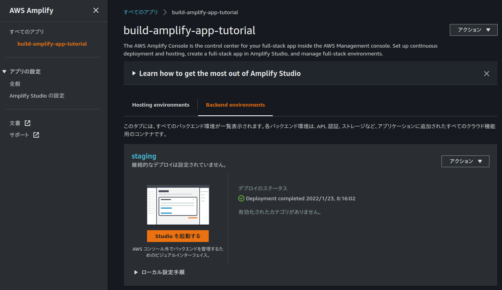

...わからんので一旦削除して最初からやり直してみることにした。
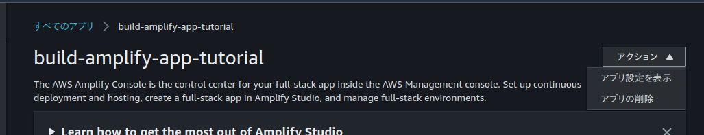

「使用を開始する」の画面に戻ったので、今度は `Amplify Hosting` を選んでみた。

チュートリアルどおりの UI だー。こっちでよかったのか…
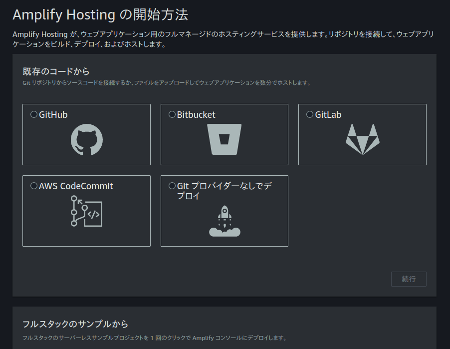

で、ドラッグ&amp;ドロップで `.7z` のファイルを放り込んだらこうなりました。どうやらサポートしてないらしい…(´・\_・\`)
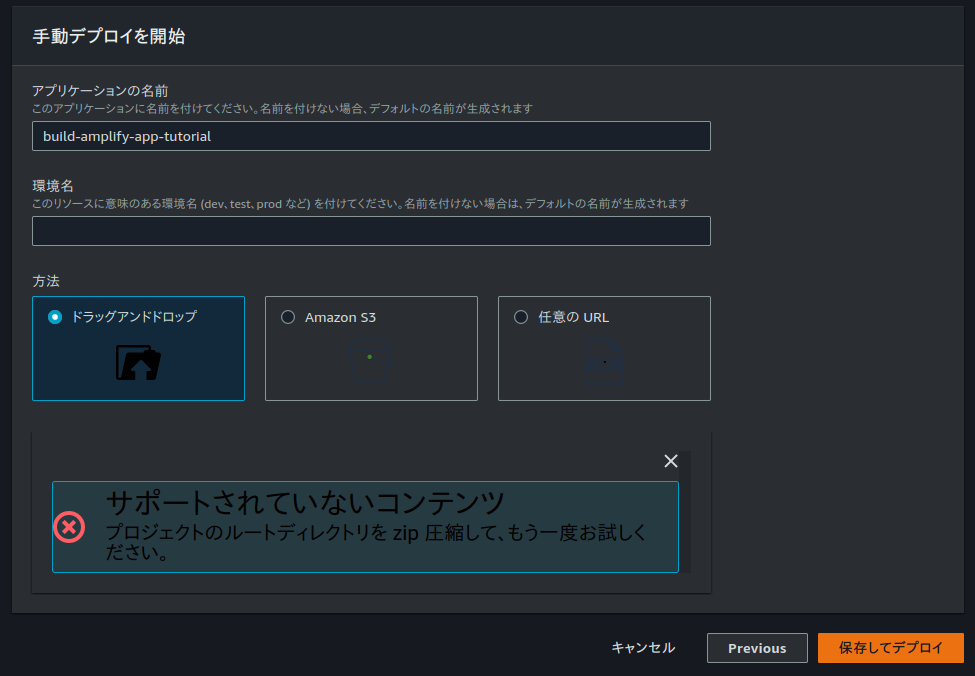

`.tar.xz` も試してみたが駄目だったので、仕方なく `.zip` にして放り込む (`.zip` はファイル名 Unicode に対応してないから避けたいんだけどね…)。で、「保存してデプロイ」でやっと先に進みました。

やり方さえ分かっちゃえば静的コンテンツを公開する方法としてはめっちゃ簡単だ罠。

## 実装: Lambda 関数を作成して設定
- [mod2-create-lambda-function ディレクトリへ](mod2-create-lambda-function/)

> 2. 必ず、関数を作成しているリージョンをメモしてください。これは、ページの最上部、アカウント名の横にあります。

オレゴンでした。

> 4. [関数名] で、「HelloWorldFunction」と入力します。

`myTutorialFunction` としてみました。

> 5. [ランタイム] ドロップダウンから [Node.js 12.x] を選択します。

最新に合わせて `Node.js 14.x` を選択。

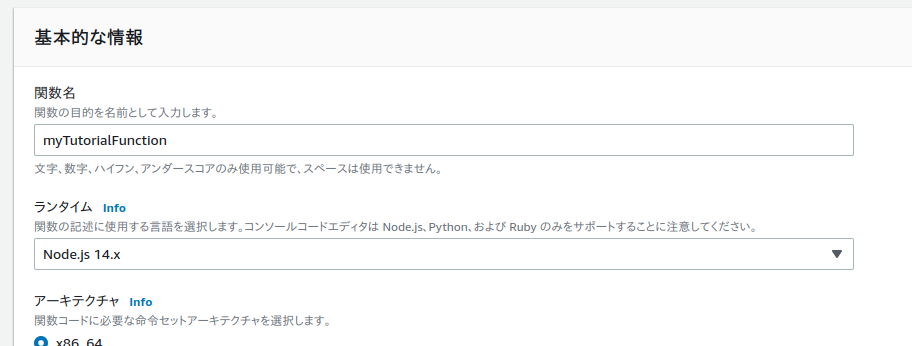

> 9. 画面上部にあるオレンジの [保存] ボタンをクリックします。

オレンジのボタンは「Test」でした。そして先に「Deploy」ボタンを押すのが正解だったっぽい?

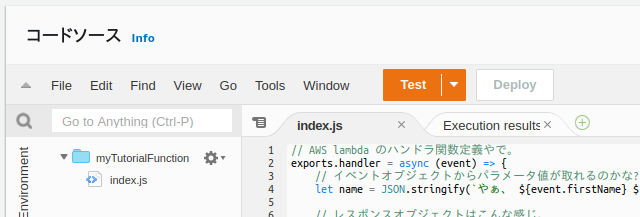

実際先に「Test」を押すと、テスト用の Lambda 関数を設定するフォームが出てきて、関数名とテスト用のパラメータ (request body となる JSON) の設定を要求される。関数名は同じく `myTutorialFunction` としてみた。(このへん画像を取り損なった…)

ただそれだけだと何故かデフォルトの Hello world 関数みたいなのが設定されちゃうので、ここで「Deploy」をクリックすると、先に設定したテスト用 Lambda 関数にコードの内容がデプロイされて、やっと「Test」ボタンでテストできるようになる。

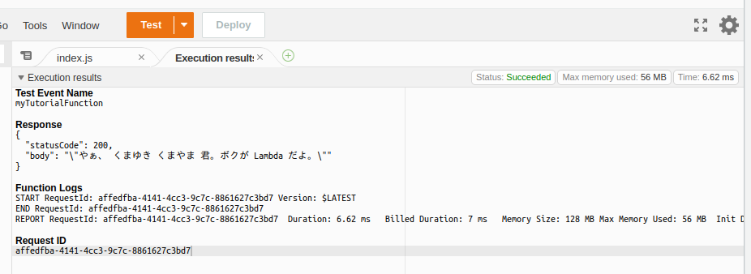

## サーバレス関数にリンクする
- [mod3-create-REST-API ディレクトリへ](mod3-create-REST-API/)

まず始める前にリージョンを確認したほうが良さげ。 API Gateway のページに入った段階で、リージョンの設定が↑と違うなら選択し直す。わい、ここでバージニア北部になってるのに気づかずに進めちゃってめっさ手戻りした… orz

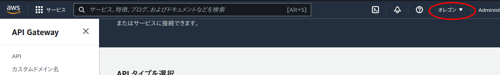

### 実装: 新しい REST API を作成する
> 2. オレンジの [API の作成] ボタンをクリックします。
> 3. REST API ボックスを見つけて、その中のオレンジの [構築] ボタンをクリックします。

2 は無かった。3 はこれのことかな?

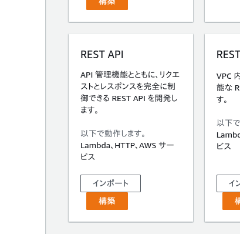

なんかアラートが出た。インポートフォーム? にサンプルプログラムをとりあえず突っ込んどいたって話?

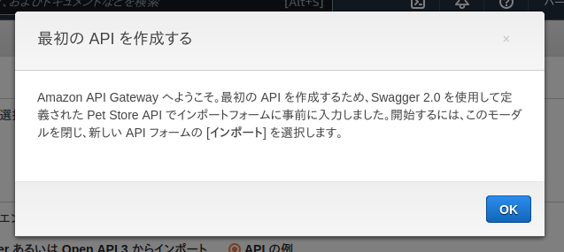

> 4. [プロトコルの選択] で、[REST] を選択します。
> 4. [Create new API] で、[New API] を選択します。
> 4. [API 名] フィールドに、「HelloWorldAPI」と入力します。
> 4. [エンドポイントタイプ] プルダウンで [エッジ最適化] を選択します

API名は `myTutorialAPI` としてみた。

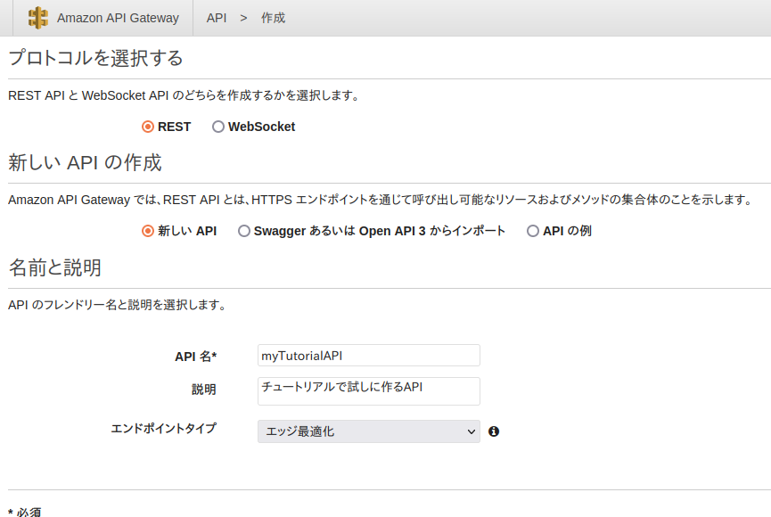

### 実装: 新しいリソースとメソッドを作成する
> 2. [/] リソースを選択した状態で、[アクション] ドロップダウンメニューから [メソッドの作成] をクリックします。

これか。

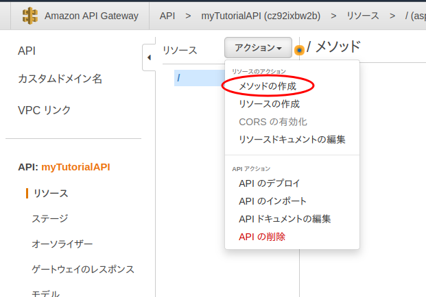

> 3. 表示される新しいドロップダウンから POST を選択し、チェックマークをクリックします。

これのことらしい。(ドロップ開いた状態ではキャプチャが上手く取れなかった…)

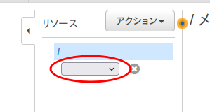

> 4. 統合タイプとして [Lambda 関数] を選択します。
> 4. [関数] フィールドに、「HelloWorldFunction」と入力します。
> 4. ブルーの [保存] ボタンをクリックします。

関数フィールドに、前のチュートリアルで作った関数名 `myTutorialFunction` を入力しようとすると、ちゃんと保管候補が出てくる。入力後の画面はこんな感じ。

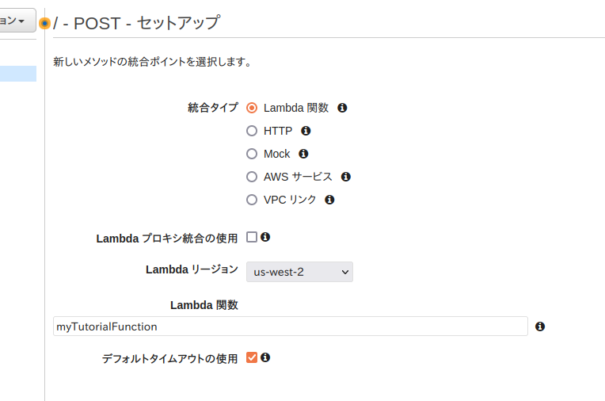

> 7. 作成している API に Lambda 関数を呼び出すアクセス許可を与えていることを知らせるメッセージが表示されます。[OK] ボタンをクリックします。

Lambda 関数に権限をつけちゃうよ、というアラートが出た。

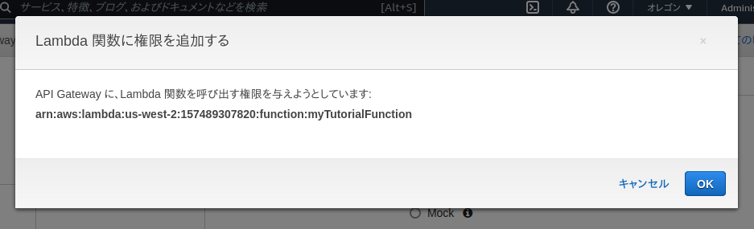

> 8. 新しく作成した POST メソッドを選択した状態で、[アクション] ドロップダウンメニューから [CORS を有効にする] を選択します。

これか。

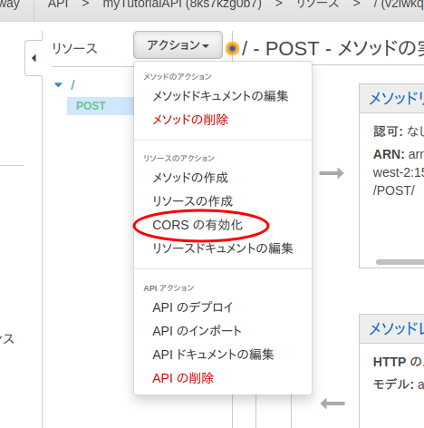

あとはだいたい書いてある通り。

### 実装: API をデプロイする

> 1. [アクション] ドロップダウンリストで、[Deploy API] を選択します。

これですね。

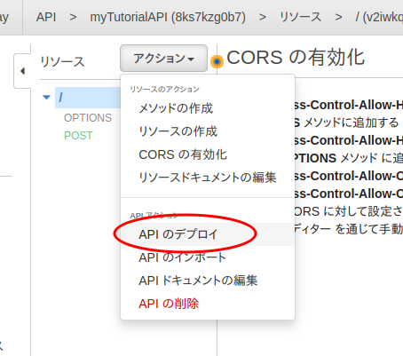

> 2. [デプロイステージ] ドロップダウンリストから [新しいステージ] を選択します。
> 2. [ステージ名] に「dev」と入力します。

こんな感じかな。


> 5. [URL を呼び出す] の横にある URL をコピーして保存します (モジュール 5 で必要になります)。

こいつのことらしい。

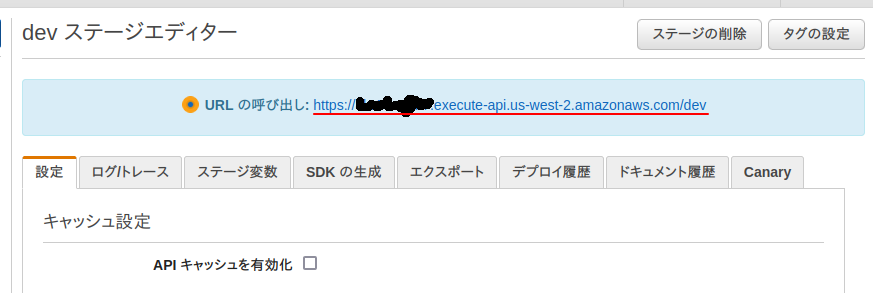

URL:
```
https://8ks7kzg0b7.execute-api.us-west-2.amazonaws.com/dev
```

## データテーブルを作成する
- [mod4-configure-dynamoDB ディレクトリへ](mod4-configure-dynamoDB/)

まずはリージョンを確認しましょう(´・\_・\`) 今度は何故かデフォがオハイオだった(´・\_・\`)

### 実装: DynamoDB テーブルを作成する

> 3. ブルーの [テーブルの作成] ボタンをクリックします。

オレンジなんだが…(´・\_・\`)

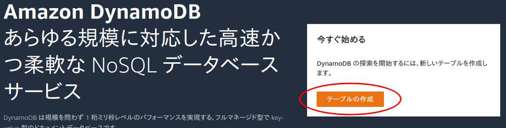

> 4. [テーブル名] の横に、HelloWorldDatabase と入力します。
> 4. [プライマリキー] フィールドに、ID と入力します。

テーブル名は `myTutorialDatabase` としてみた。「プライマリキー」は、今は「パーティションキー」と呼んでいるらしい。

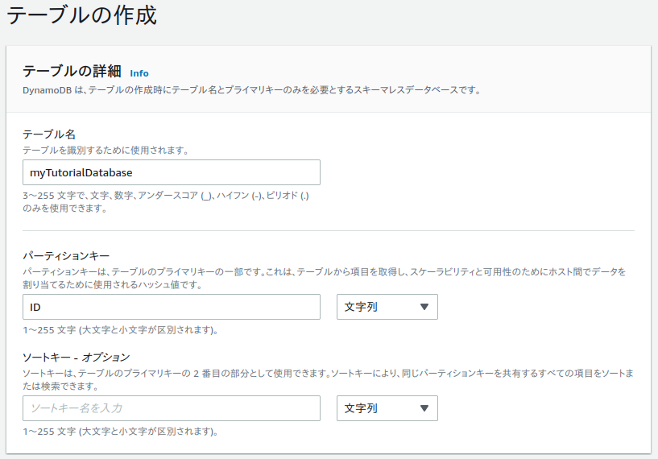

> 6. ブルーの [作成] ボタンをクリックします。

だからオレンジだっつの…

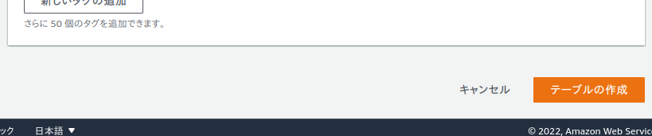

状態は作成中だが正常に作成されたらしい。つかなんで 2行あるんだ? (´・\_・\`)

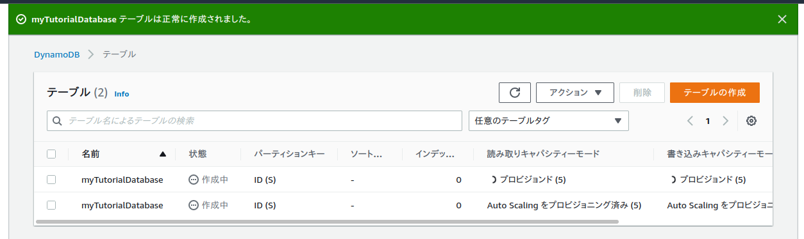

> 7. 右側のパネルからテーブルの「Amazon リソースネーム (ARN) 」をコピーします (後でこのモジュールで必要になります)。

作成後の画面が↑の状態だったので ARN なんて出てこねーぞって最初は焦った(´・\_・\`)

ブラウザを更新したらこんな感じの画面になったので、

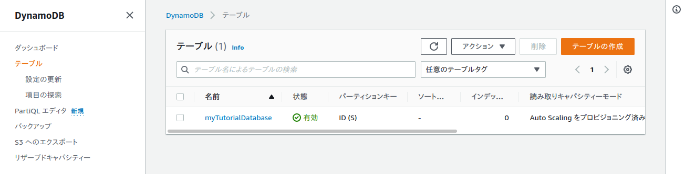

テーブル名をクリックして設定画面を開いたら、「一般的な情報」セクションの「追加情報」をクリックすると…

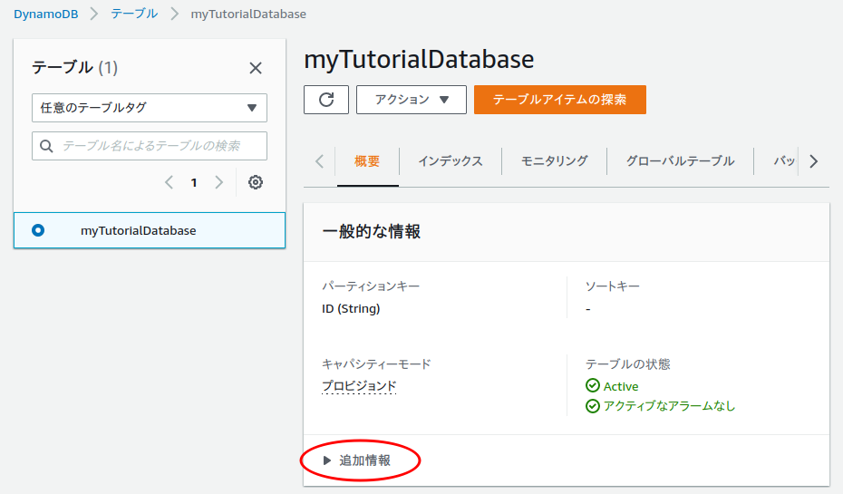

同セクションの下の方に ARN が表示された。

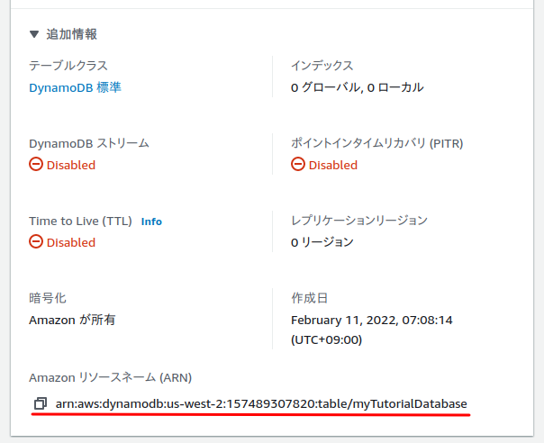

ARN:
```
arn:aws:dynamodb:us-west-2:157489307820:table/myTutorialDatabase
```

### 実装: IAMポリシーを作成してLambda関数に追加

> 3. DynamoDB サービスを使用できるように関数にアクセス許可を追加します。このために、AWS Identity and Access Management (IAM) を使用します。
> 3. [アクセス許可] タブをクリックします。
> 3. [実行ロール] ボックスで、ロールをクリックします。新しいブラウザタブが開きます。

3 はただの説明? 4 は全然違っていて、「設定」タブの「アクセス権限」メニューが正解。

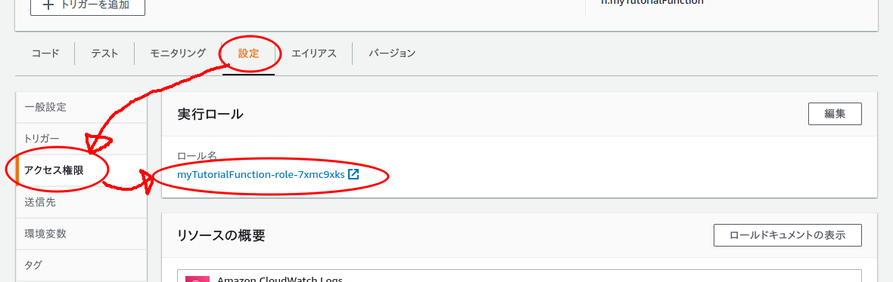

> 6. [アクセス許可ポリシー] ボックスの右側にある [インラインポリシーの追加] をクリックします。

「許可ポリシー」セクション右側の「アクセス許可を追加」→「インラインポリシーを作成」が正解。

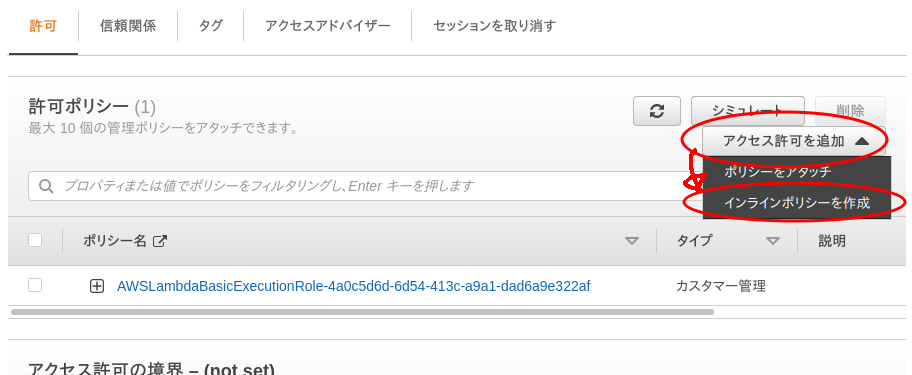

> 12. ブルー の [ポリシーの作成] ボタンをクリックします。
> 12. これで、このブラウザータブを閉じて、Lambda 関数のタブに戻ることができます。

気が早いな…「ポリシーの作成」ボタンを押したらこんなページに遷移したぞ。

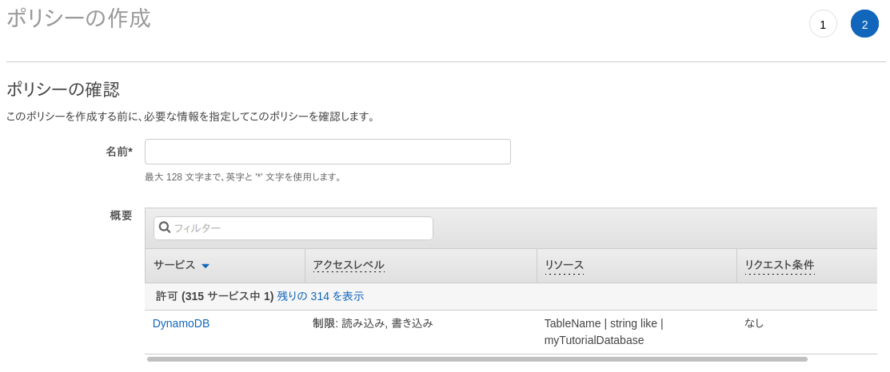

名前が必須らしいので、 `myTutorialFunctionRolePolicy` としてみた。

で、画面最下部にまだ「ポリシーの作成」ボタンが居るので、もう一度クリック。これでようやくポリシーの設定が完了。今作成したポリシーがちゃんと追加されていることが確認できる。

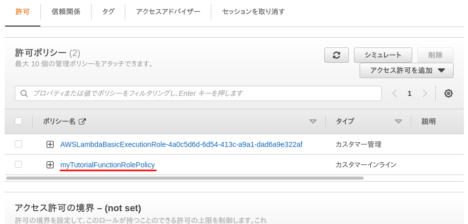

### 実装: Lambda 関数を変更して DynamoDB テーブルに書き込む

> 1. [設定] タブをクリックします。

相変わらずおかしなことを言ってるが、ここは「コード」タブやな。(面倒なので画像は割愛)

> 3. ページの上部にあるオレンジの [保存] ボタンをクリックします。

これもオレンジの「Test」ボタンで動作確認してからの、白い「Deploy」ボタンが正解やな。

### 実装: 変更をテスト

> 1. 白の [テスト] ボタンをクリックします。
> 1. グリーンの背景の「実行結果: 成功」メッセージが表示されます。

DynamoDB への書き込みを実際に行うテストを駆動したい場合は、コードタブ内の「テスト」ボタンではなく、「テスト」タブを使うのが正しいらしい。こちらの「テストイベント」セクション内にあるオレンジの「テスト」ボタンをクリックすると、下の画像のような結果の画面が得られる。

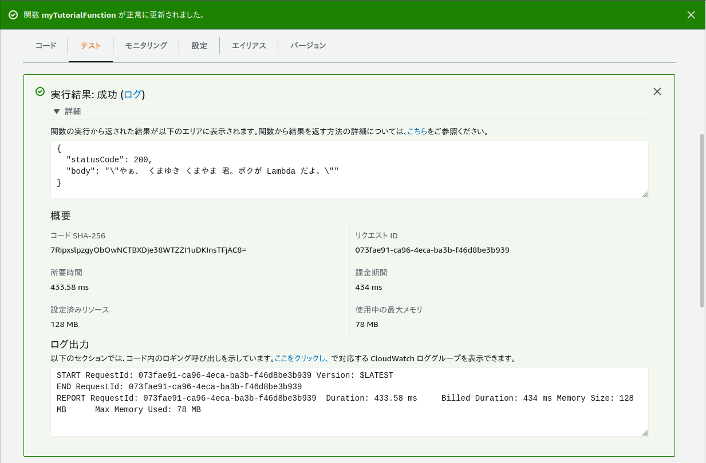

> 6. 右側の [アイテム] タブをクリックします。
> 6. テストイベントに一致するアイテムがここに表示されます。

オレンジの「テーブルアイテムの探索」ボタンをクリック、が正解。

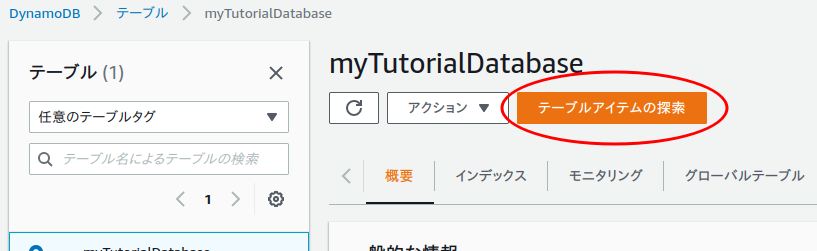

「アイテムのスキャン/クエリ」セクションで「スキャン」を選んでフィルター何もなしで「実行する」をクリックすれば、追加された値が閲覧できる。

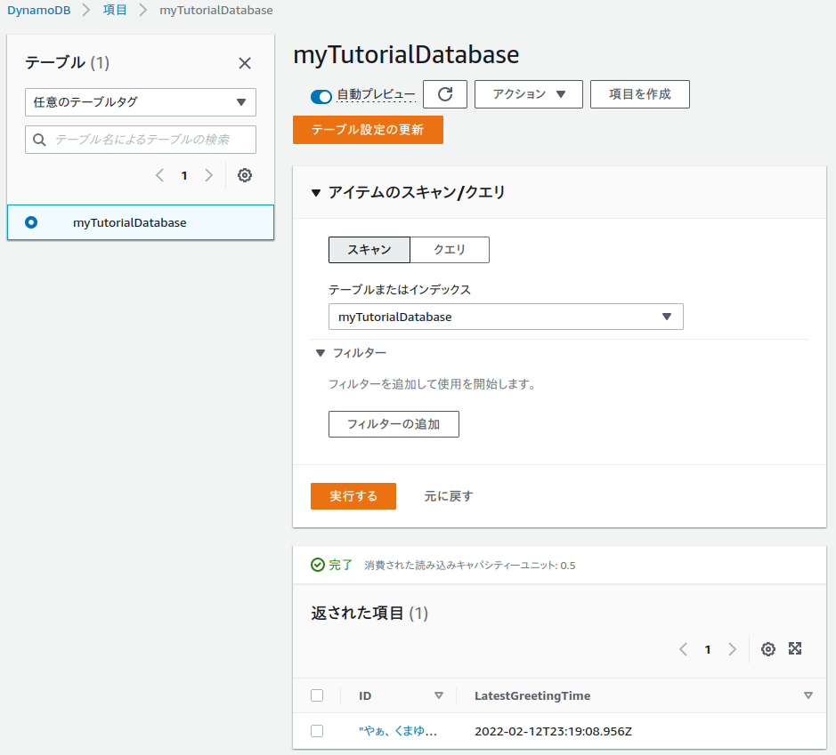
