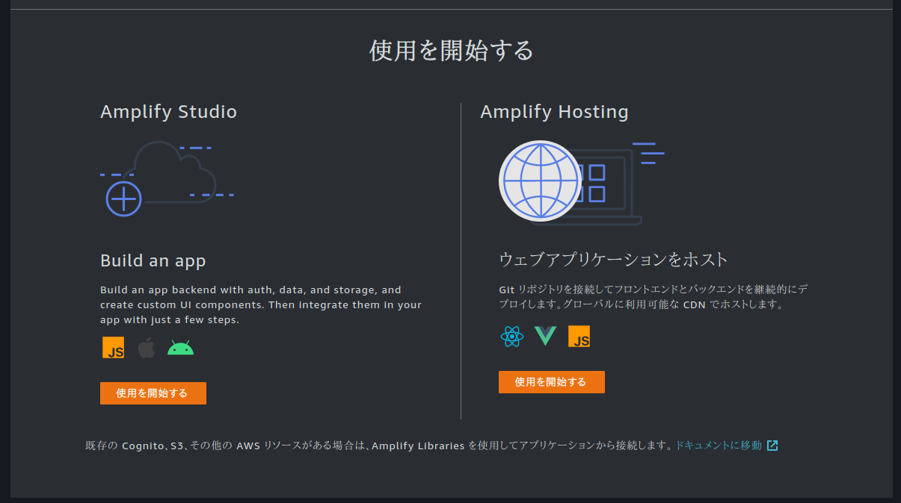
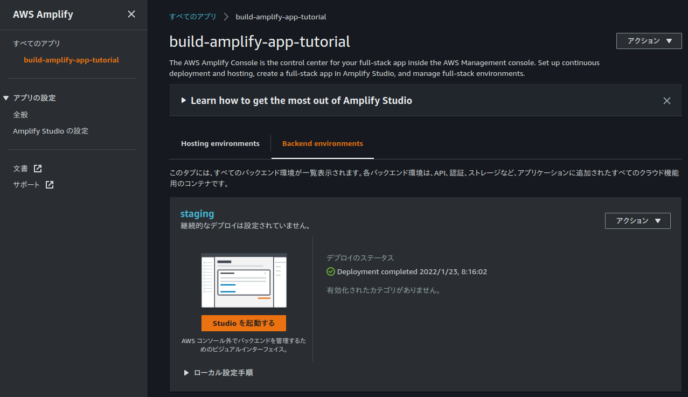
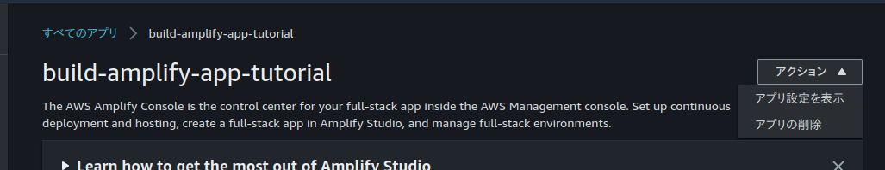
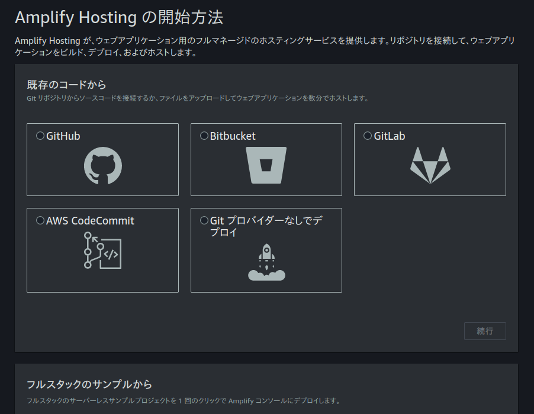
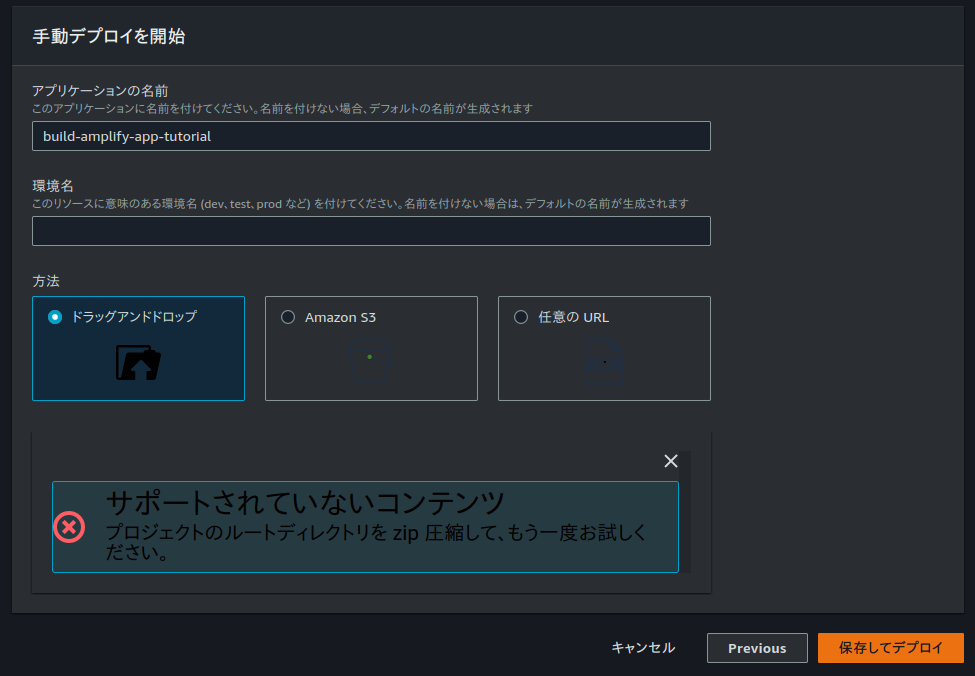

# 基本的なウェブアプリケーションを構築するチュートリアルをやってみた

https://aws.amazon.com/jp/getting-started/hands-on/build-web-app-s3-lambda-api-gateway-dynamodb/

## 実装: Amplify コンソールでウェブアプリを作成
- [build-amplify-app ディレクトリへ](build-amplify-app/)

> 3.HTML ファイルのみを ZIP (圧縮) します。

アーカイバは何使ってもいいのか? とりあえず 7zip 形式を使ってみる。

> 6.[Git プロバイダーなしでデプロイ] を選択します。以下のように画面に表示されるはずです。

UI 全然違った(´・\_・\`)。

Git 使わない方法だからとりあえず `Amplify Studio` を選んでおけばいいのかな?

> 8.[App 名] フィールドに、「GettingStarted」と入力します。

`build-amplify-app-tutorial` という名前にしてみた。

バックエンド環境の構築はまあまあ時間がかかる様子… 1〜2分程度で完了。

> 9.環境名には、「dev」と入力します。

どこに入力するんだ? (´・\_・\`) つか、すでに staging になっちゃってるっぽいが? (´・\_・\`)

...わからんので一旦削除して最初からやり直してみることにした。

「使用を開始する」の画面に戻ったので、今度は `Amplify Hosting` を選んでみた。

チュートリアルどおりの UI だー。こっちでよかったのか…

で、ドラッグ&amp;ドロップで `.7z` のファイルを放り込んだらこうなりました。どうやらサポートしてないらしい…(´・\_・\`)

`.tar.xz` も試してみたが駄目だったので、仕方なく `.zip` にして放り込む (`.zip` はファイル名 Unicode に対応してないから避けたいんだけどね…)。で、「保存してデプロイ」でやっと先に進みました。

やり方さえ分かっちゃえば静的コンテンツを公開する方法としてはめっちゃ簡単だ罠。
